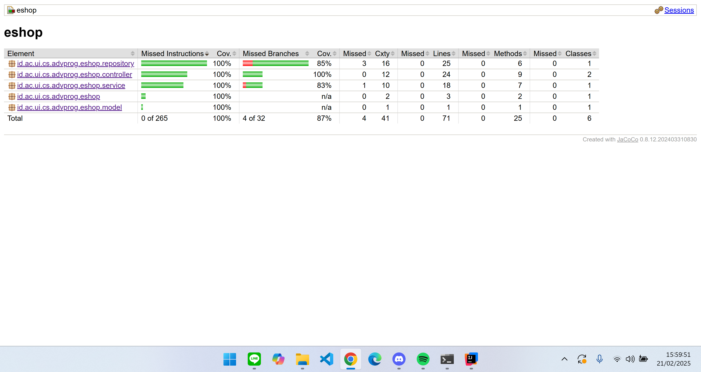

# eshop
https://perfect-rabbit-malv-9750a611.koyeb.app/

https://perfect-rabbit-malv-9750a611.koyeb.app/product/list
## Module 1
## Reflection 1

### Clean Code Principles
- **Meaningful Names**: The names of classes and methods clearly represent their intended function.
- **Functions**: Methods in controllers are dedicated to specific tasks, such as creating or updating a product.
- **Comments**: Minimal use of comments, relying on descriptive names and brief docstrings when needed.
- **Data Structures**: Product objects store only essential information, with clear getter and setter methods.
- **Error Handling**: With bean validation enabled, invalid or missing inputs are handled by early returns, directing users back to the form.

#### Example Code Snippet – Creating a Product
The following example illustrates how we process a new product creation request. Bean validation checks the user input (e.g., ensuring the product name is not empty and the quantity is greater than or equal to 1). If validation fails, the form is returned to the user; otherwise, the product is created and the user is redirected to the product list:

```java
@PostMapping("/create")
public String createProductPost(@Valid @ModelAttribute Product product,
                                BindingResult result,
                                Model model) {
    if (result.hasErrors()) {
        // Return back to the create form if validation fails
        return "createProduct";
    }
    service.create(product);
    return "redirect:list";
}
```

Here is a simplified HTML form (using Thymeleaf) that users complete to create the product. The form fields directly map to the Product class fields:
```html
<form th:action="@{/product/edit}" th:object="${product}" method="post">
        <input type="hidden" th:field="*{productId}"/>
        <div class="form-group">
            <label for="nameInput">Name</label>
            <input th:field="*{productName}" type="text" id="nameInput" class="form-control mb-4 col-4">
        </div>
        <div class="form-group">
            <label for="quantityInput">Quantity</label>
            <input th:field="*{productQuantity}" type="text" id="quantityInput" class="form-control mb-4 col-4">
        </div>
        <button type="submit" class="btn btn-success">Update</button>
    </form>
```
By combining meaningful names, concise validation, and straightforward form rendering, we keep our code both readable and reliable.

## Secure Coding Practices
- **ID Generation:** If no ID is provided, a UUID is generated to avoid ID duplication.

- **Validation (Future Enhancement):** Extend bean validation with more specific constraints.

- **Authorization (Future):** Restrict certain endpoints to authorized users.

- **Output Data Encoding (Future):** Implement encoding for dynamically rendered fields to prevent XSS vulnerabilities.

## Possible Improvements
- Add more detailed exception handling for edge cases.
- Increase test coverage (unit and functional tests) to ensure that existing features are not broken by changes.

# Reflection 2
After adding unit tests, I feel way more confident about how reliable the app is. The tests serve as a kind of early warning—if something changes or breaks, the tests will catch it fast. I usually figure out how many tests to write based on how complex the class is and all the different scenarios we need to check. Code coverage tools can help spot untested lines or paths, but just having 100% coverage doesn’t necessarily mean the code is bug-free.
For our new functional test suite, which checks things like creating products and counting them on the list page, here are some important points for keeping the code clean:

1. **Potential Duplication**

- If the setup or teardown logic repeats too much in test classes, it gets messy.
- It’s easier to maintain when we put common steps in a base test class or helper methods.

2. **Hard-Coded Values and Shared State**

- Using fixed values too often (like product IDs or names) can make the code harder to read.
- Generating random or parameterized test data can make tests clearer and more robust.

3. **Single Responsibility in Tests**

- Tests that check multiple things at once can be confusing.
- It’s better when each test focuses on one thing. This way, debugging is faster if a test fails.

4. **Readability and Naming**

- Test names should be clear and descriptive (e.g., shouldCreateProduct_whenValidData).
- Using consistent naming conventions helps keep the tests easy to understand.

5. **Test Data Management**

- Utility methods to create or reset sample data reduce repetition and keep the “Arrange, Act, Assert” structure clean.
- Repeated creation steps should be refactored into @BeforeEach or helper methods.

## Suggestions for Improvement:

- **Use a Base Functional Test Class:** Put common logic (like driver setup or form-filling steps) into a parent class.
- **Maintain Meaningful Test Names:** The test name should explain what’s being verified and the expected outcome.
- **Don’t Rely on Coverage Alone:** Use coverage to find untested parts, but remember it doesn’t mean everything’s fully tested just because the code runs.

## Module 2
### Reflection 
#### Fixed Code Quality Issues
1. JUnit 5 Test Method Naming Convention:
   
Issue: The JUnit 5 test methods testFindById_NotFound and pageTitle_isCorrect didn't adhere to the naming convention [a-z][a-zA-Z0-9]*, meaning they had underscores in the method name. 

Fix: Renamed the methods to use camel case and removed underscores,  
such as:
  testFindById_NotFound → testFindByIdNotFound

2. Unused Static Import Warning:

Issue: The static import org.junit.jupiter.api.Assertions.* was flagged as unused.  

Fix: Modified it to import only the specific assertion methods that were being used in the test (such as assertNotNull, assertEquals, etc.).


#### CI/CD Workflows 


Looking at the CI/CD workflows (GitHub Actions in this case), I think the current setup totally fits the definition of Continuous Integration (CI) and Continuous Deployment (CD).

##### Continuous Integration (CI): 
With GitHub Actions, every time there’s a push or pull request to any branch, the workflows automatically run. This helps make sure that all code changes are tested and integrated continuously, avoiding any integration issues.

##### Continuous Deployment (CD): 
For deployment, Koyeb takes care of it automatically. Whenever there’s a push or pull request, the project gets deployed right away, so the latest updates are live without having to do anything manually.

In short, everything’s set up to keep things automated, from testing and integrating code to pushing updates straight to production.

